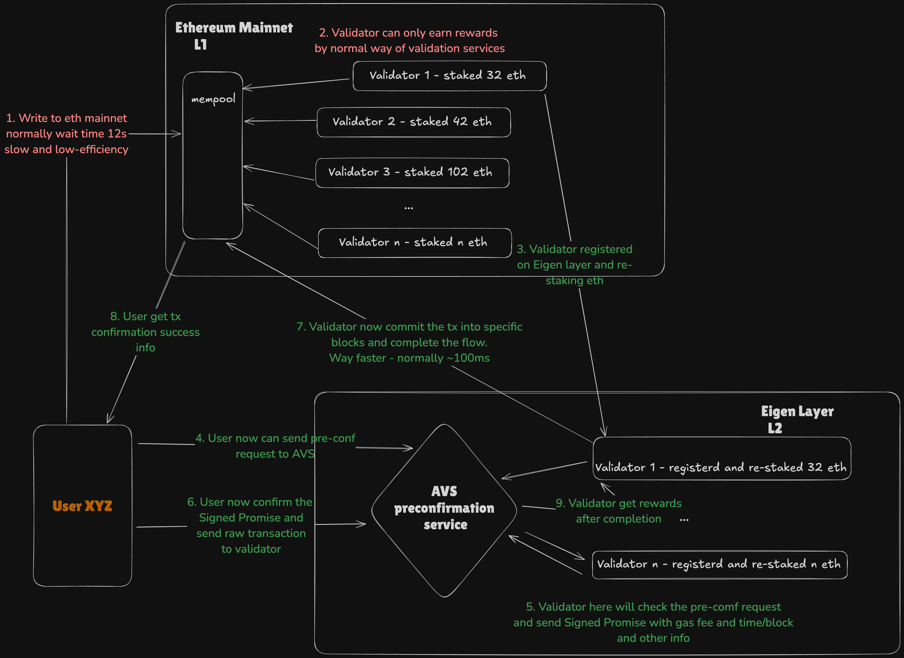
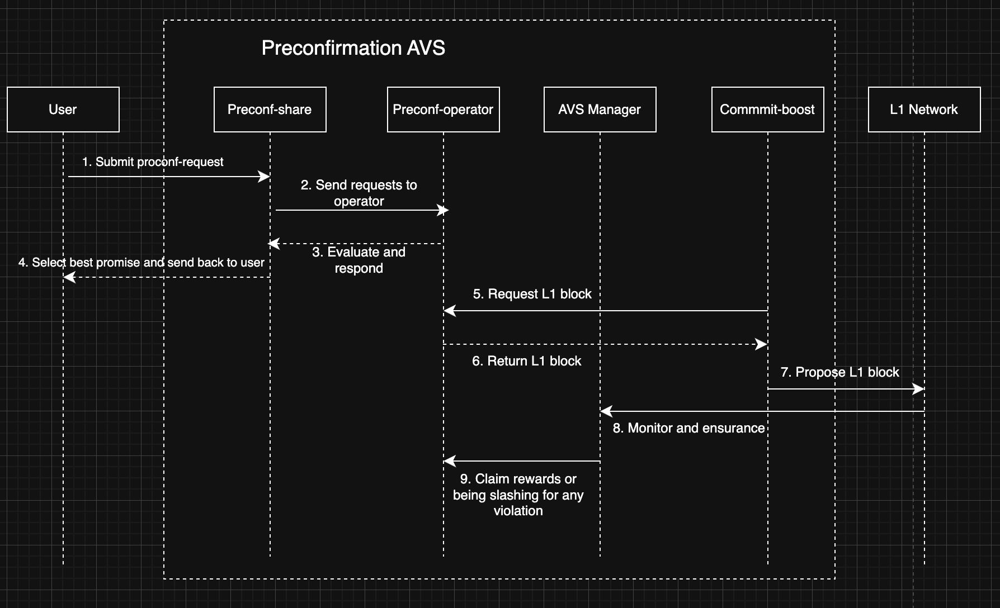

# Preconfirmation AVS Design

## 📋 Overview
Design an Active Validator Service(AVS) on EigenLayer that provides credible preconfirmations for Eth transactions.

---

## 🎯 Target
- Low lantency: Offer a solution with ~100ms processing time.
- Highly secure: Make sure the preconfirmation AVS service is credible to both user and validator. 
- Incentive: Include reasonable mechanism to reward/punish validators' activites. Be attractive to more validators.
- Compatibility: Can be easily integrated with L1 networks and reuse some features from Eigenlayer restaking.

---

## 🎯 Objectives
- [System Architecture](#-system-architecture)
- [Economic Model](#-economic-model)
- [Security Analysis](#-security-analysis)
- [Implementation Considerations](#-implementation-considerations)

---

## 💡 Background

- High level of Users/L1 network/AVS+EigenLayer(L2) diagram. (Happy path)

---

## 💡 System Architecture
- **Protocol design**:
    - High level flow chart for AVS preconf service:

    

    0. Eth's validators register and join preconfirmation AVS service.
    1. User send a pre-conf request to a "trusted matchmaker" preconf-share (Similar to Flashbot MEV-Share) with specific requirements. (block inclusion guarantees, timing preferences, etc) This step can be done by submitting a request via a wallet, application or API call. 
    2. Preconf-share will collect the requests and send to the upcoming proposer/preconfirmer. It servers as a matchmaker and can based on user's preference(target slot or max latency) to rank the promise and help user to select the most suitable one.
    3. Validator(via preconf-operators) evaluate the request and issue signed preconfirmation promises.
    4. Preconf-share ranks  the received promises and return the best one to user.
    5. A commit boost here will request the L1 block and ensures preconfirmed transactions are prioritized and included in the block.
    6. The chosen preconf-operator includes the transaction into the promised block and return it.
    7. Commit boost propose the L1 block to network.
    8. AVS manager monitors the response, ensuring the transaction is included and reports any violations. Also deliver the rewards or slashing for any violation.

- **Key entities and roles**:
    1. Preconf-share (offchain service)
        - Serve as a bridge between users and validators, distributing user requests and ranking preconfirmation promises.
        - Receive user request and validate feasibility.
            - Checking the tip
            - Target block
            - Constraints
        - Sends requests to the relevant Preconf-Operators (validators for the next few blocks).
        - Ranking responses:
            - Collects preconfirmation promises (signed by Preconf-Operators) and ranks them based on user-defined criteria(tip size/target block/latency)
        - Returning the Best Promise to user.
    2. Preconf-operator (offchain service)
        - The validator node that interacts with the Preconf-Share system and handles preconfirmation logic.
        - Listen for event stream from prconf-share.
        - Evaluation.
        - Sign promise if feasible.
            - Includes the transaction hash, target block, tip, timing and etc.
        - Execution
            - Ensure the transaction is included in the promised block.
    3. AVS manager (Onchain smart contract)
        - Tracking and monitoring
            - Ensure all transactions are fulfilled.
            - Handle fallback scenarios if promise cannot be fulfilled.
        - Rewards and Slashing
            - Distributed rewards
            - Slashing for violations

- **Preconfirmation considerations**:
    - How should operators create and sign preconfirmations?
        -  Transaction details should include:
            - Transaction hash
            - Target block number
            - Validity window (time or block range)
            - Incentive(tips)
            - Signature
            - Timestamp
        - Validate feasibility
            - Gas estimation. Tx won't exceeding gas limits.
            - Block slot availability. Consider other pending transactions or perconfirmations.
            - Incentive evaluation. Check if tip is sufficient.
            - Transaction validity. Validate tx's format and correct nonce or valid signature.
        - Construct preconfirmation
            - Return an object back with all required details.
            - Sign the preconfirmation. If operator fails to fulfill the promise, this signed preconfirmation can serve as evidence for slashing penalties.
    
    - What mechanisms can we use to verify preconfirmations?
        - Verify the signature that has not been tampered with.
        - The preconfirmation promise contains a hash of the transaction. Compare and verify it.
        - Add a pre-confirmer role to verifying preconfirmation promises.
        - Fault proof mechanisms like Optimistic Rollups for broken promises.
    
    - What mechanisms handle preconfirmation conflicts and revocations?
        - Priority based resolution. Resolves conflicts by ranking preconfirmations based on:
            1. Higher tips
            2. Ealier timestamp if sharing the same tips
            3. User preference
        - Revocations:
            1. If the revocation is within a validity window(before block building phase starts) and no malicious intent, no penalty will required and updated logs for revocation and notified users.
            2. If the revocation is malicious intent and excessive revocations from the validator, then they will lose a portion of their stake as a penalty.
    
    - What happens to preconfirmations during chain reorganizations?
        - If the preconfirmation specifies a range of valid blocks (e.g., N to N+2), the promise may still be fulfilled in subsequent blocks.
        - These transactions are typically returned to the mempool unless otherwise excluded or replaced.
        - Applied dynamic solutoin to this: 
            - Transactions from reorged blocks are reprioritized in the mempool to ensure they are included in the replacement blocks.
            Validators assign higher priority to reorged preconfirmed transactions to maintain system integrity.

    - Since proposers are known of 32 blocks in advance, thus a reasonable window should balance predictability, security and useability. Should consider followings:
        - User Expectation. Are they looking for quick feedback? If so, preconfirmation should target next few blocks.
        - Based on use cases. Short-term(1-5 blocks) provides low latency and high reliability. Long-term(11-32 blocks ahead) will be best suited for future transactions that are not time-critical.
        - Implement a dynamic window based on network conditions. (congestion, reorg risks)
            - Shorter window during high congestion
            - Longer window during low activity periods
    
    - Preconfirmation requests need to be sent well before the 8-second build time starts; otherwise, builders won't have enough time to include them in the block. To guarantee inclusion, users should aim to negotiate preconfirmations at least 12-16 seconds before the target block time.
    - Propagation Delays affect:
        - Ensure low-latency communication between the preconfirmation system and the block builder.
        - Use private relays (like Flashbots' system) to guarantee quick and secure delivery of preconfirmed transactions.

- **State management approach**:
    - Preconfirmation request state:
        - [Pending, Confirmed, In Progress, Completed, Expired, Revoked]
    - Validator state:
        - [Active, Under Review, Suspended, InActive]
    - Store state on Layer 2 for scalability, while syncing critical data to Layer1 for transparency.

---

## 💡 Economic Model
Explain the proposed solution in detail:
- **Description**: Describe the solution and how it solves the problem.
- **Methodology**: Outline the approach or technologies involved.
- **Deliverables**: List what will be delivered (e.g., code, documentation, designs).

---

## 💡 Security Analysis
- Use cryptographic techniques (commit-reveal schemes) to protect sensitive transaction data in preconfirmation requests, reducing the risk of frontrunning or gaming.

---

## 💡 Implementation Considerations
Provide an actionable plan for implementation:
1. **Phase 1**: Define the initial setup or research phase.
2. **Phase 2**: Outline development or production steps.
3. **Phase 3**: Describe testing and deployment.

---

## 📌 Risks and Mitigation
- **Risk 1**: Consecutive validators could potentially collude to break preconfirmation promises. How
might you prevent this?  
  - **Mitigation**: 
    - Limit the number of preconfirmed transactions allowed per block.
    - Use a fallback mechanism (e.g., roll over unprocessed preconfirmed transactions to subsequent blocks).

- **Risk 2**: What happens if a block containing preconfirmed transactions gets reorged?
    - **Mitigation**: Plan to address it

- ** Risk 3**: If a proposer receives a preconfirmation request just before the build phase, they might fail to include it, resulting in broken preconfirmation promises and potential slashing.
    - **Mitigation**: Implement a cutoff time for preconfirmation requests (e.g., 20 seconds before the target block).
Reject or deprioritize requests submitted after this cutoff to reduce the risk of broken promises.

---

## 🔗 References
Include any references, links, or resources for further information:
- [Based Preconfirmation - JustinDrake](https://ethresear.ch/t/based-preconfirmations/17353/1)
- [Puffer Docs](https://docs.puffer.fi/unifi-avs-protocol)
- [Luban](https://docs.luban.wtf/learn/architecture/off_chain_components/overview)
- [Eigen Build your own AVS](https://docs.eigenlayer.xyz/developers/how-to-build-an-avs)

---

## 🚀 Call to Action
Look forward to your feedbacks on this proposal!
