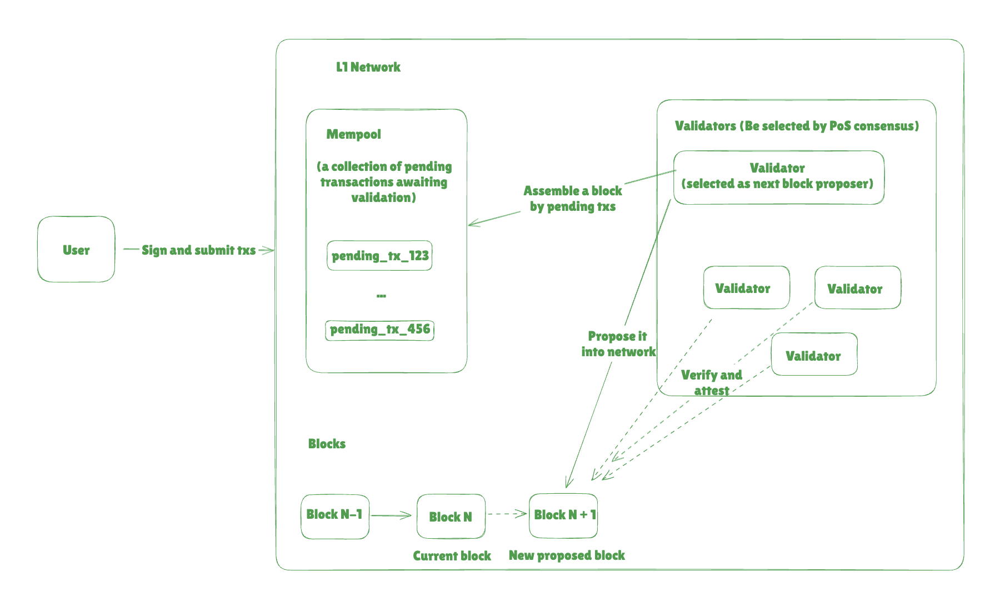
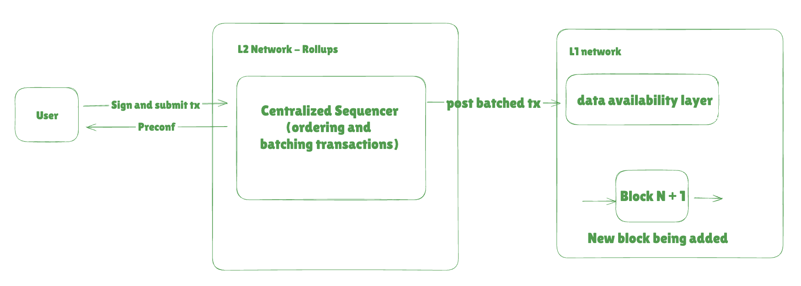
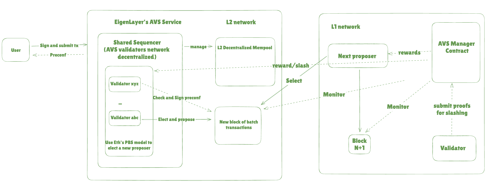

# An EigenLayer's AVS Preconfirmation Design

## 📋 Overview
Design an Active Validator Service(AVS) on EigenLayer that provides credible preconfirmations for Eth transactions.

---

## 🎯 Target
- Low lantency: Offer a solution with ~100ms processing time.
- Highly secure: Make sure the preconfirmation AVS service is credible to both user and validator. 
- Incentive: Include reasonable mechanism to reward/punish validators' activites.
- Compatibility: Can be easily integrated with L1 networks and reuse some features from Eigenlayer restaking.

---

## 🎯 Objectives
- [System Architecture](#-system-architecture)
- [Economic Model](#-economic-model)
- [Security Analysis](#-security-analysis)
- [Implementation Considerations](#-implementation-considerations)

---

## 💡 Background

### Ethereum L1 Transaction Flow

#### Trade-offs:
- Latency: Slow Finalization (~12 seconds per block)
    - Transactions need multiple block confirmations (~2-3 minutes) for strong security guarantees.
    - Reorg risks in the first few blocks mean transactions aren't immediately final.
    - For real-time applications, this delay is a major bottleneck.
- High Gas Costs (~$1 to $50 per transaction)
    - Users compete for block space → Higher gas fees during congestion.
    - MEV (Maximal Extractable Value) causes frontrunning and gas fee spikes.
- Scalability Limitations (~15 TPS)
    - Ethereum L1 processes ~15 transactions per second (TPS).
    - Demand far exceeds capacity, leading to network congestion.
- No Instant Transaction Ordering Guarantees
    - Transactions in the mempool are unconfirmed, meaning:
        - They can be reordered or front-run by MEV bots.
        - There’s no guarantee when a transaction will be included (depends on gas fees).
        - Users can wait minutes for inclusion, even longer during high congestion.
- Censorship Risks in the Mempool
    - Validators may choose not to include certain transactions
    - Flashbots and MEV-Boost relay censorship can prevent transactions from appearing in blocks.

### L2 rollups + centrailized sequencer + preconf

#### Pros:
- Faster Transaction Processing, low-latency.
- L2 rollups support 1,000+ TPS (vs. L1’s ~15 TPS).
- Lower Costs

#### Cons:
- Censorship Risk – The sequencer can arbitrarily exclude or delay transactions.
- Downtime & Centralization – A single-point-of-failure.
- MEV Exploitation – The sequencer could reorder transactions to profit from MEV opportunities.
- Trust Assumptions – Users must trust that the sequencer will behave honestly.

---

## 💡 System Architecture
### High level flow chart for AVS preconf + decentralized sequencer:

1. User submits a tx to Shared Sequencer inside the EigenLayer's AVS service.
2. A "winning" validator is elected inside the AVS validator decentralized network and proposes an ordered batch of transactions.
3. Other AVS validators check this batch and sign preconfirmation commitments. These preconfs are stored on-chain for later slashing usage.
4. User get instant feedback.
5. The next L1 proposer selects the AVS preconfirmed tx for inclusion.
6. If preconfirmed transaction is missing, AVS manager slash "winning" sequencer/validator.
7. If the AVS batch get verified, transaction are finalized and send out the rewards to each participates.

---

### Preconfirmation considerations:

- How to pick up the "winning" validator in the decentralized AVS validator network?
    - Staked Weight Lottery (Similar to PoS consensus) - A weighted random selection picks the next winner based on re-stacked size.
    - Reason:
        - Simple and efficient
        - Stake more -> higher commitment to honest behavior
        - Misbehaves, lost their re-stakes

- How should operators create and sign preconfirmations?
    -  Transaction details should include
        - Transaction hash
        - Target block number
        - Validity window (time or block range)
        - Incentive(tips)
        - Signature
        - Timestamp
    - Validate feasibility
        - Gas estimation. Tx won't exceeding gas limits.
        - Block slot availability. Consider other pending transactions or perconfirmations.
        - Incentive evaluation. Check if tip is sufficient.
    - Construct preconfirmation
        - Return an object back with all required details above.
        - Sign the preconfirmation. If operator fails to fulfill the promise, this signed preconfirmation can serve as evidence for slashing penalties.
    
- What mechanisms can we use to verify preconfirmations?
    - Verify the signature that has not been tampered with.
    - The preconfirmation promise contains a hash of the transaction. Compare and verify it.

- What mechanisms handle preconfirmation conflicts and revocations?
    - Priority based resolution. Resolves conflicts by ranking preconfirmations based on:
        1. Higher tips
        2. Ealier timestamp if sharing the same tips
    - Revocations:
        1. If the revocation is within a validity window(before block building phase starts) and no malicious intent, no penalty will required and updated logs for revocation and notified users.
        2. If the revocation is malicious intent and excessive revocations from the validator, then they will lose a portion of their stake as a penalty.

- What happens to preconfirmations during chain reorganizations?
    - Reprioritized in the mempool to ensure they are included in the replacement blocks.
    - Assign higher priority to reorged preconfirmed transactions.

- Since proposers are known of 32 blocks in advance, thus a reasonable window should balance predictability, security and useability. Should consider followings:
    - Implement a dynamic window based on network conditions. (congestion, reorg risks)
        - Shorter window during high congestion
        - Longer window during low activity periods

- Preconfirmation requests need to be sent well before the 8-second build time starts; otherwise, builders won't have enough time to include them in the block. To guarantee inclusion, users should aim to negotiate preconfirmations at least 12-16 seconds before the target block time.

---

### State management approach:
- Preconfirmation request state:
    - [Pending, Confirmed, In Progress, Completed, Expired, Revoked]
- Validator state:
    - [Active, Under Review, Suspended, InActive]

## 💡 Economic Model
- **Design of penalties for safety violations**:
    - Harshest penalty - 100% slash of restaking value
        - Validators submit fraud proof showing invalid execution.
        - If verified, the sequencer loses all stake (full slashing).
        - A new leader takes over, and affected users receive compensation.
    - Lose future chance to join the decentralized validator network

- **Design of penalties for liveness violations**:
    - The severity of slashing depends on the frequency and magnitude of the liveness violation.
    - Reduces the validator’s earned rewards (transaction fees, tips, or block rewards) for failing to maintain liveness.
    - Incremental Penalties for Repeated Violations

- **Fee structures that incentivize honest behavior**: 
    - Rewards for AVS winning validator/sequencer
        - Users pay a gas fee for transaction inclusion (like traditional rollup fees). 
    - Rewards for AVS Validator for checking and signing preconf
        - Validators who sign preconfirmations earn a share of the sequencer fees, which ensures all AVS participants benefit, not just the winner.
    - Rewards for L1 proposers
        - L1 inclusion fee.

- **MEV considerations**:
    - Use of Inclusion Lists. Prevents censorship and ensures preconfirmed transactions are included regardless of MEV opportunities.
    - PBS solution. Instead of one validator deciding transaction order, sequencing is split into two roles, which forces validators to follow predefined fair-ordering rules.

- **Collusion prevention mechanisms**:
    - Slashing for Collusion
        - Penalizes validators who engage in collusion by slashing their staked collateral.
        - A system smart contract monitors validator behavior and slashes stakes if collusion is detected(conflicting promises or excluded preconfirmed transactions).

- **How do we handle network issues vs. deliberate omission?**:
    - Slashing severity levels based on intent:
        - Single missed preconfirmation -> No slashing, warning
        - Repeated missed -> 5 - 10% slashing
        - Frequent late inclusion - 20% slashing
        - Deliberate omission - 50% slashing
        - Tampering preconfimrations - 100% slashing, removed from Sequencer network
---

## 💡 Security Analysis
- **Attack vectors**:
    - User level: 
        - Attackers reuse preconfirmation promises or transactions across multiple blocks or chains.
        - Includes unique identifiers (nonces, timestamps) in preconfirmation promises to prevent reuse.
    - Validator level:
        - Collusion: Validators collaborate to manipulate transaction inclusion, reorder transactions, or censor specific transactions.
        - Validators issue conflicting preconfirmation promises for the same transaction or block, creating ambiguity.

- **Frontrunning or gaming**:
    - Use cryptographic techniques (commit-reveal schemes) to protect sensitive transaction data in preconfirmation requests.

---

## 💡 Implementation Considerations
1. **Builder integration**:
    - Ensure that preconfirmed transactions are included in the promised order or range.
    - Validate the signed preconfirmation promises attached to transactions.
    - For integrating with EigenLayer's restaking system, we should utilize restaked ETH or other tokens as collateral to guarantee the performance and accountability of validators participating in the AVS.
2. **Network timing constraints**:
    - Preconfirmation systems must ensure that validators can process promises and include transactions within ~12s.
    - Use peer-to-peer propagation protocols optimized for low-latency communication.
    - Use high-performance infrastructure (low-latency APIs) to handle requests.
3. **Scalability approach**:
    - Handle preconfirmation commitments off-chain while anchoring them to Layer 1 for security.
    - Spread validation tasks across multiple nodes to reduce bottlenecks.
    - Validators handle preconfirmation requests in parallel to block-building tasks.
    - Use Merkle trees to batch promises and reduce data size.
4. **Upgrade path**:
    - Design upgrades to be implemented with minimal network interruptions.
    - Ensure upgrades do not disrupt existing preconfirmation promises or validator operations.
    - Deploy upgrades on testnets to identify bugs or performance bottlenecks.

---

## 📌 Risks and Mitigation
- **Risk 1**: Consecutive validators could potentially collude to break preconfirmation promises. How might you prevent this?  
  - **Mitigation**: 
    - Limit the number of preconfirmed transactions allowed per block.
    - Use a fallback mechanism (roll over unprocessed preconfirmed transactions to subsequent blocks).

- **Risk 2**: What happens if a block containing preconfirmed transactions gets reorged?
    - **Mitigation**: Similar to above. Fallback to a subsequent blocks.

- **Risk 3**: If a proposer receives a preconfirmation request just before the build phase, they might fail to include it, resulting in broken preconfirmation promises and potential slashing.
    - **Mitigation**: Implement a cutoff time for preconfirmation requests (20 seconds before the target block).
Reject or deprioritize requests submitted after this cutoff to reduce the risk of broken promises.

---

## 🔗 References
Include any references, links, or resources for further information:
- [Based Preconfirmation - JustinDrake](https://ethresear.ch/t/based-preconfirmations/17353/1)
- [Puffer Docs](https://docs.puffer.fi/unifi-avs-protocol)
- [Luban](https://docs.luban.wtf/learn/architecture/off_chain_components/overview)
- [Eigen Build your own AVS](https://docs.eigenlayer.xyz/developers/how-to-build-an-avs)
- [Introduction to Based Rollups and Preconfirmations](https://www.youtube.com/watch?v=aFl8zXSdXac)
---

## 🚀 Call to Action
Look forward to your feedbacks on this proposal!
